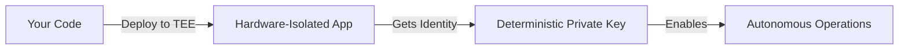
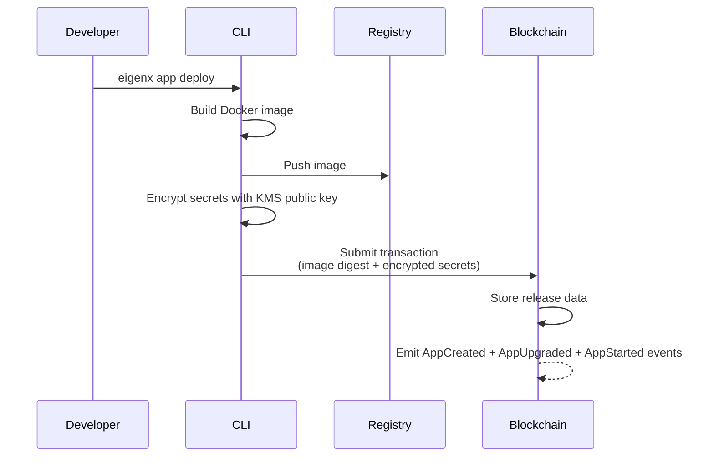
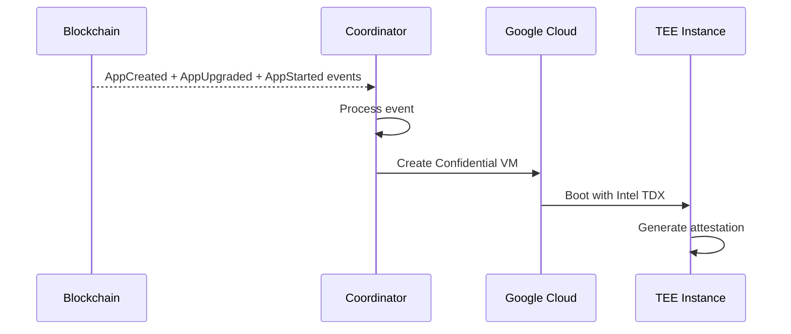
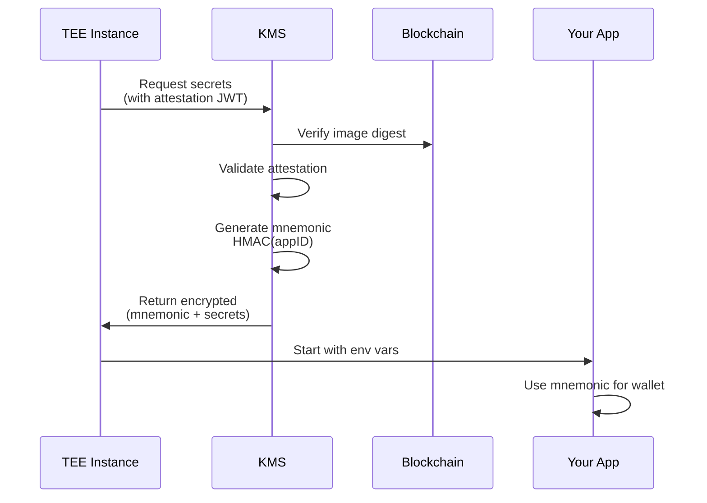
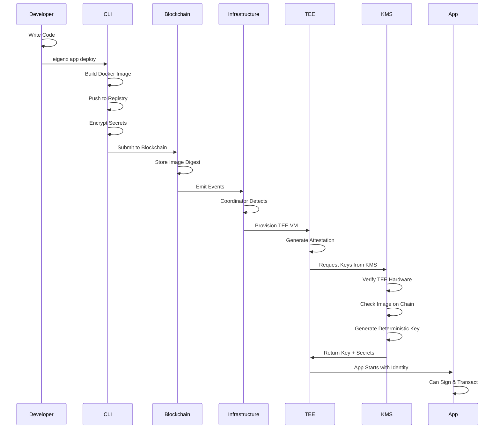
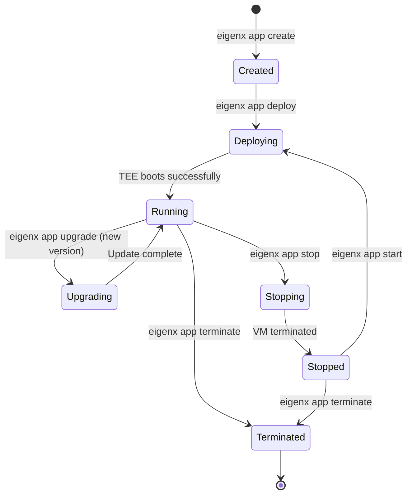
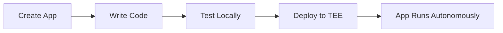
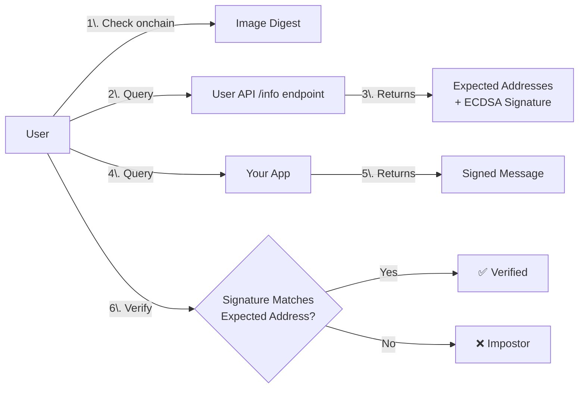

# Architecture Guide

## Summary

EigenX enables developers to deploy **verifiable applications** in Trusted Execution Environments (TEEs). Each app receives its own deterministic wallet that serves as its cryptographic identity, allowing it to sign transactions, hold funds, and operate autonomously.

---

## Core Concept: Deterministic Application Identities

### How EigenX Enables Autonomous Applications

When you deploy an app through EigenX, the system provides:

1. **A unique private key** derived deterministically from your app's ID
2. **Hardware-isolated execution** via Intel TDX trusted execution environments
3. **Cryptographic attestation** proving which exact Docker image (by digest) has access to the key
4. **Autonomous capabilities** - your app can hold funds, sign transactions, and operate independently

This architecture enables applications to act as self-sovereign entities with their own wallets, where users can verify the exact code running rather than trusting the developer.



---

## System Architecture Layers

The system is organized into four distinct layers, each with clear responsibilities:

### 1. Trust Layer
**Purpose**: Establish what should run and who gets keys

| Component | What It Is | Role in System | Technology |
|-----------|------------|----------------|------------|
| **Blockchain** | Ethereum smart contracts | Source of truth for app configurations and authorized code | Solidity on Ethereum |
| **KMS** | Key Management Service | Gatekeeper that verifies TEE attestations and provides deterministic keys and app secrets | Rust service with HSM |

### 2. Execution Layer  
**Purpose**: Run your code in hardware isolation

| Component | What It Is | Role in System | Technology |
|-----------|------------|----------------|------------|
| **TEE Instance** | Hardware-isolated VM | Secure runtime for your Docker container | Intel TDX on Google Cloud |

### 3. Automation Layer
**Purpose**: Bridge blockchain events to infrastructure (no access to secrets)

| Component | What It Is | Role in System | Technology |
|-----------|------------|----------------|------------|
| **Coordinator** | Event processor service | Watches blockchain, provisions/manages VMs | Rust with PostgreSQL |

### 4. Developer Layer
**Purpose**: Tools for building and deploying

| Component | What It Is | Role in System | Technology |
|-----------|------------|----------------|------------|
| **CLI** | Command-line tool | Build, deploy, and manage apps | Go |
| **Registry** | Docker registry | Store and distribute container images | Any OCI registry |

---

## How The System Works

### Deployment Flow: Phase by Phase

#### Phase 1: Developer Deployment



**What happens:**
1. Developer runs `eigenx app deploy` with their application
2. CLI builds a Docker image and pushes to registry
3. CLI encrypts developer's secrets using KMS's public key (RSA-OAEP + AES-256-GCM)
4. CLI submits transaction with image digest, encrypted secrets, and public environment variables
5. Smart contract stores this data and emits events

#### Phase 2: Infrastructure Provisioning



**What happens:**
1. Coordinator service detects blockchain events
2. Coordinator provisions a new Google Confidential Space VM
3. VM boots with Intel TDX hardware isolation
4. TEE generates launch attestation JWT proving its configuration

#### Phase 3: Secret Retrieval & App Startup



**What happens:**
1. TEE sends attestation to KMS requesting secrets
2. KMS verifies the TEE is genuine and running correct code
3. KMS generates deterministic mnemonic for this app
4. KMS returns encrypted mnemonic + developer secrets
5. App starts with `MNEMONIC` environment variable

### Complete Deployment Flow



### App Lifecycle State Machine

Your app moves through these states during its lifetime:



---

## System Guarantees

### What This Architecture Guarantees ✅

| Guarantee | How It's Achieved | What It Means |
|-----------|-------------------|---------------|
| **Code Integrity** | Only exact Docker images (by digest) stored onchain can run | Users know precisely what code is executing |
| **Key Exclusivity** | TEE attestation required for key access | Only TEE instances running verified code receive keys |
| **Deterministic Identity** | HMAC(appID) generates same key every time | App keeps same addresses even after redeployment |
| **Hardware Isolation** | Intel TDX memory encryption | Keys are isolated from host operating system |
| **Attestation Chain** | Hardware → Google → KMS → Blockchain | Cryptographic proof of what's running |

### Current Trust Requirements ⚠️

| Component | What You Trust | Why It's Needed | Future Solution |
|-----------|---------------|-----------------|-----------------|
| **KMS Operator** | Single entity controls key release | Centralized attestation verification | Threshold KMS (M-of-N) |
| **RPC Provider** | Accuracy of blockchain data | KMS needs to verify image digests | Light client in TEE |
| **No Replica Protection** | Apps can run multiple instances | No hardware-enforced singleton | Consensus mechanism |

---

## Why This Architecture Matters

### Autonomous Application Capabilities

With deterministic identities, applications can:
- **Manage their own wallets** - receive and control funds directly
- **Sign transactions independently** - no external key management infrastructure  
- **Provide cryptographic proofs** - users verify code, not developer promises
- **Operate trustlessly** - behavior determined by published code

### Example Use Cases

| Use Case | How EigenX Enables It |
|----------|----------------------|
| **Trading Bot** | Holds user funds in its own wallet, executes trades based on strategy, can't steal money (code is verified) |
| **Data Oracle** | Signs data feeds with its identity, proves it's running unmodified aggregation code |
| **Game Server** | Manages in-game assets fairly, players can verify game logic isn't cheating |
| **Escrow Service** | Holds funds autonomously, releases based on code logic, no trusted third party |
| **DAO Executor** | Executes DAO decisions autonomously, members verify execution logic |

---

## Developer Integration

### Architecture Comparison

**Traditional Architecture:**
```
Application Server → Private Keys (Developer Controlled) → Signing Operations → Users Trust Developer
```

**EigenX Architecture:**
```
TEE Instance → Deterministic Key (via KMS) → Signing Operations → Users Verify Code
```

The key distinction: applications receive keys deterministically based on their identity, with the TEE hardware guaranteeing that only the exact Docker image stored onchain can access those keys. This removes the need for developers to manage private keys and enables users to cryptographically verify what code has access to funds.

### Development Workflow



1. **Create**: `eigenx app create my-app typescript`
2. **Develop**: Write your application logic
3. **Test**: Run locally with test mnemonics
4. **Deploy**: `eigenx app deploy` (automatic encryption)
5. **Verify**: Check app addresses with `eigenx app info`

### Integration Example

```typescript
// The application receives its identity via environment variable
const mnemonic = process.env.MNEMONIC  // Provided by KMS after attestation

// Derive wallets for any supported chain
import { mnemonicToAccount } from 'viem/accounts'
const ethAccount = mnemonicToAccount(mnemonic)

// Application capabilities:
// 1. Receive funds at deterministic address
const address = ethAccount.address

// 2. Create cryptographic proofs of identity
const signature = await ethAccount.signMessage({
  message: 'Attestation from verified trading bot'
})

// 3. Execute transactions autonomously
const tx = await walletClient.sendTransaction({
  account: ethAccount,
  to: userAddress,
  value: profitShare
})
```

### Key Properties for Developers

1. **Deterministic Derivation**: Consistent key generation via HMAC(appID)
2. **Environment Injection**: Keys provided via `MNEMONIC` environment variable
3. **Chain Agnostic**: Support for BIP-44 derivation across multiple blockchains
4. **No Key Management**: Infrastructure handles key distribution post-attestation

---

## Verification Flow

Developers can cryptographically verify application authenticity:



The KMS provides a signed message that includes what addresses your app should have, and users can verify your app controls those addresses.

---

## Roadmap

### Current State
- ✅ Basic TEE deployment with deterministic keys
- ✅ Google Confidential Spaces integration
- ✅ Single KMS operator model

### Coming Soon
- ⏳ Intel Trust Authority attestations (publicly verifiable, bypass Google CS attestations)
- ⏳ Public runtime attestations from apps
- ⏳ Threshold KMS (M-of-N distributed key management)
- ⏳ Replica prevention via onchain checks and heartbeats
- ⏳ Light client or full node in TEE (remove RPC dependency)
- ⏳ Verifiably built images
- ⏳ Persistent storage

---

## Recap

EigenX provides a foundational primitive for blockchain applications: **deterministic, hardware-attested application identities**. This enables autonomous applications that can manage funds, sign transactions, and operate independently while remaining cryptographically verifiable.

The architecture combines blockchain for configuration truth, TEEs for isolated execution, and deterministic key derivation to create a new class of verifiable applications. While the current implementation requires trust in the KMS operator, the progressive decentralization roadmap addresses this through threshold cryptography and enhanced verification mechanisms.

This approach enables previously impossible use cases: trustless trading bots, verifiable oracles, autonomous escrow services, and other applications where users need cryptographic guarantees about code behavior rather than trusting developers.
