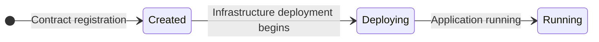
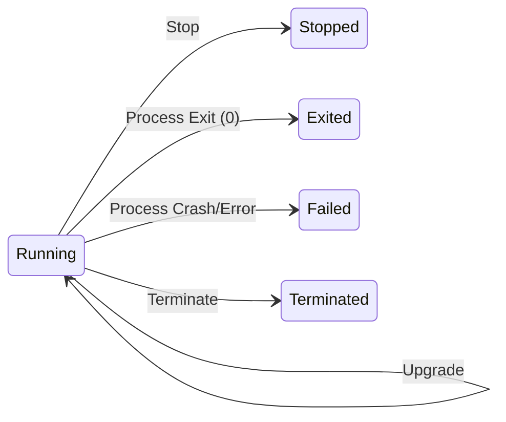
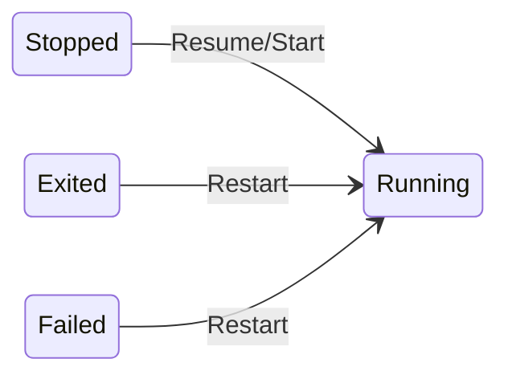
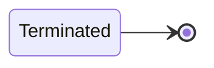

# EigenX Concepts Guide

A comprehensive guide to understanding keys, environment variables, app lifecycle, and privacy in EigenX CLI.

---

# Overview of Keys

EigenX CLI uses two distinct key types. Each has a specific role, lifecycle, and security boundary.

## 1. EigenX Auth Keys (`eigenx auth`)

| Category      | Details                                                                                                                     |
| ------------- | --------------------------------------------------------------------------------------------------------------------------- |
| **Purpose**   | Developer authentication for deployments and protocol interactions                                                          |
| **Type**      | secp256k1 private key (Ethereum-compatible)                                                                                 |
| **Location**  | Local OS or organization keyring (macOS Keychain, 1Password, Windows Credential Manager, Linux Secret Service, etc.)       |
| **Lifecycle** | - Generate: `eigenx auth generate`   - Import: `eigenx auth login`   - View: `eigenx auth whoami`, `eigenx auth list` |
| **Security**  | Developer must secure and store this secret securely to sign deployment transactions                                        |

## 2. TEE Mnemonic

| Category        | Details                                                                       |
| --------------- | ----------------------------------------------------------------------------- |
| **Purpose**     | Persistent wallet for applications running inside a TEE                       |
| **Type**        | BIP-39 mnemonic phrase (12/24 words)                                          |
| **Origin**      | Generated by [KMS](https://github.com/Layr-Labs/eigenx-kms/blob/master/kms.md), released only to your application via enclave [attestation](https://docs.trustauthority.intel.com/main/articles/articles/ita/concept-attestation-overview.html)  |
| **Location**    | Encrypted at rest in [KMS](https://github.com/Layr-Labs/eigenx-kms/blob/master/kms.md); only decryptable inside your specific TEE application|
| **Access**      | Provided at runtime via `process.env.MNEMONIC`                                |
| **Persistence** | Stable across restarts and deployments                                        |
| **Security**    | The mnemonic is cryptographically bound to your specific TEE instance. No other TEE, application, or party can decrypt it. Once inside the TEE, it's a plain secret and should be handled with care. Do not log or exfiltrate it. |

## Key Storage Locations

| Location                                | Keys             | Notes                                                               |
| --------------------------------------- | ---------------- | ------------------------------------------------------------------- |
| **Local Machine (OS Keyring)**          | EigenX Auth Keys | Stored under `eigenx-<environment>` (e.g., `eigenx-mainnet`)        |
| **TEE (Trusted Execution Environment)** | TEE Mnemonic     | [KMS](https://github.com/Layr-Labs/eigenx-kms/blob/master/kms.md)-generated, persistent wallet, bound to your app via [attestation](https://docs.trustauthority.intel.com/main/articles/articles/ita/concept-attestation-overview.html) |

## Security Model

* **Auth Keys** Developer owned. Must be backed up and secured.
* **TEE Mnemonic** [KMS](https://github.com/Layr-Labs/eigenx-kms/blob/master/kms.md) managed. Only your specific TEE application can decrypt it, but app developers must handle it like any sensitive secret once inside.

## Key Distinctions

* **Auth Keys** are for developers and used for protocol operations, deployments.
* **TEE Mnemonic** is for applications and used for persistent wallet functionality inside the TEE. It also gives the ability to verify that you are communicating with the correct TEE application.

The TEE mnemonic is generated by the [KMS](https://github.com/Layr-Labs/eigenx-kms/blob/master/kms.md) and bound to your app's enclave, ensuring consistency across deployments. But once injected, its safety depends on the app not leaking it.

---

# Overview of Environment Variables

EigenX CLI encrypts your sensitive configuration during deployment using [KMS](https://github.com/Layr-Labs/eigenx-kms/blob/master/kms.md) encryption keys. This ensures your secrets remain accessible exclusively to your TEE application, never to third parties, operators, or other applications. You can optionally make certain values public for user transparency.

## Environment Variable Security

| Category        | Details                                                                           |
| --------------- | ----------------------------------------------------------------------------- |
| **Encryption**  | During deployment, all `.env` variables are encrypted with a [KMS](https://github.com/Layr-Labs/eigenx-kms/blob/master/kms.md) key unique to your TEE |
| **Storage**     | Encrypted environment variables are posted on-chain                           |
| **Decryption**  | Decryption happens only inside your TEE at runtime - inaccessible to anyone else |
| **Access**      | Available to your application via standard `process.env` variables           |
| **Security**    | Your responsibility to handle securely and not exfiltrate from the TEE       |

## Public Variables

| Category        | Details                                                                       |
| --------------- | ----------------------------------------------------------------------------- |
| **Suffix**      | Add `_PUBLIC` suffix to variable names for transparency                       |
| **Visibility**  | `_PUBLIC` variables are visible to users and not encrypted                   |
| **Use Case**    | Configuration values that should be transparent (e.g., `API_URL_PUBLIC`)     |
| **Security**    | No sensitive data should use the `_PUBLIC` suffix                            |

## Security Model

* **Encrypted Variables** [KMS](https://github.com/Layr-Labs/eigenx-kms/blob/master/kms.md) managed, on-chain storage, cryptographically bound to your TEE
* **Public Variables** Transparent to users, not encrypted, visible on-chain
* **Application Responsibility** Handle all environment variables securely once inside TEE

## Environment Variable Distinctions

* **Standard `.env` variables** are encrypted and decryptable exclusively within your TEE
* **`_PUBLIC` suffixed variables** are transparent and visible to users for configuration transparency

**Current Security Model (Mainnet Alpha):** EigenLabs has access to [KMS](https://github.com/Layr-Labs/eigenx-kms/blob/master/kms.md) signing and decryption keys, meaning they can theoretically access encrypted environment variables. This access is necessary for current operations but will be migrated to a hardened external system.

**Future Security Model:** A new set of keys will be generated and moved to an external hardened system. This will enable encryption/decryption and key derivation without EigenLabs access. Additionally, KMS upgrades will require onchain authorization.

Decryption is cryptographically restricted to your specific TEE instance and authorized parties. Your application must handle these values responsibly and never log or exfiltrate sensitive data.

---

# Overview of App Lifecycle

EigenX applications progress through distinct states with specific transitions. Understanding these states helps manage deployments effectively.

## App States

| State          | Details                                                                       |
| -------------- | ----------------------------------------------------------------------------- |
| **Created**    | App registered in AppController contract but no infrastructure deployed yet          |
| **Running**    | App is actively running and serving traffic                                  |
| **Stopped**    | App temporarily stopped, can be resumed without losing configuration         |
| **Exited**     | App process finished executing and exited normally (exit code 0). Your application enters this state when your code finishes execution. If you want your app to run continuously, ensure you have a long running process like a web server. |
| **Failed**     | App process crashed or terminated with non-zero exit code                   |
| **Terminated** | App permanently destroyed, all resources deallocated                         |

## State Transitions

| Transition     | Details                                                                       |
| -------------- | ----------------------------------------------------------------------------- |
| **Deploying**  | Infrastructure deployment process, moving from Created to Running            |
| **Upgrading**  | Updating existing app with new image, maintains configuration and data       |
| **Resuming**   | Restarting a Stopped/Exited app, moving to Running                          |
| **Stopping**   | Gracefully stopping a Running app, moving to Stopped state                  |
| **Terminating**| Permanently destroying app and resources, moving to Terminated state        |

## Lifecycle Flow

### Initial Deployment
App is registered in AppController contract (Created state), then infrastructure deployment begins (Deploying), and finally reaches Running state when application code is running.

### From Running State
Once running, apps can be stopped, can exit normally, fail, be terminated, or upgraded.

### Resuming Apps
Stopped, Exited, and Failed apps can all be restarted back to Running state.

### Terminal State
Only Terminated apps reach a true final state with all resources destroyed.

## Lifecycle Distinctions

* **Created vs Running** Created means app is registered but no infrastructure exists; Running means infrastructure is deployed and serving
* **Deploy vs Start** Deploy only registers the app in smart contract; Start actually provisions infrastructure
* **Stopped vs Terminated** Stopped apps can be resumed with all configuration intact; Terminated apps are permanently destroyed
* **Exited vs Failed** Both indicate the app process ended, but Failed indicates an error occurred.
* **Continuous vs Batch** Web servers and long running services stay in Running state; batch jobs and scripts naturally transition to Exited when complete

---

# Overview of Privacy

EigenX CLI provides strong privacy guarantees through TEE isolation and encryption. Understanding what's private and what's visible helps developers build secure applications.

## Private to your TEE application

| Category              | Details                                                                       | Example Use Case |
| --------------------- | ----------------------------------------------------------------------------- | ---------------- |
| **TEE Mnemonic**      | [KMS](https://github.com/Layr-Labs/eigenx-kms/blob/master/kms.md)-generated mnemonic only accessible inside your specific TEE instance     | Build an autonomous trading bot that manages real funds without exposing private keys to operators |
| **Encrypted Env Vars**| Environment variables encrypted by [KMS](https://github.com/Layr-Labs/eigenx-kms/blob/master/kms.md), only decryptable within your TEE     | Store API keys for payment processors or AI services that your app uses - even EigenLabs can't see them |
| **Application Code**  | Your containerized application runs in isolation within the TEE              | Run proprietary trading algorithms or ML models where the logic itself is valuable IP |
| **Runtime Data**      | Memory contents, temporary files, and process state isolated in TEE          | Process user PII or financial data in memory without it being accessible to cloud providers |
| **Private Keys**      | Any keys derived from or stored within the TEE environment                   | Generate signing keys for multi-party computation or [attestations](https://docs.trustauthority.intel.com/main/articles/articles/ita/concept-attestation-overview.html) that prove computation happened correctly |

## Publicly Visible Information

| Category              | Details                                                                       |
| --------------------- | ----------------------------------------------------------------------------- |
| **App Metadata**      | App ID, name, deployment status, and basic configuration                     |
| **Container Image**   | Docker image reference and tags used for deployment                          |
| **Container Registry**| Your container hosted on DockerHub/OCI registries is publicly viewable      |
| **Public Env Vars**  | Environment variables with `_PUBLIC` suffix                                  |
| **Network Endpoints** | Public IP addresses and exposed ports for your application                   |
| **Logs (If Public)** | Application logs only if configured to be public (private by default)        |

## Customer Privacy Guarantees

| Guarantee             | Details                                                                       |
| --------------------- | ----------------------------------------------------------------------------- |
| **Code Isolation**    | Your application code executes in hardware-enforced isolation                |
| **Data Encryption**   | All sensitive data encrypted at rest and decryptable within TEE. In the Mainnet Alpha, EigenLabs has KMS key access. Future releases will use a hardened external system with onchain-authorized upgrades.         |
| **Attestation-Based**| [KMS](https://github.com/Layr-Labs/eigenx-kms/blob/master/kms.md) releases secrets to verified TEE instances via cryptographic [attestation](https://docs.trustauthority.intel.com/main/articles/articles/ita/concept-attestation-overview.html) proof  |
| **Limited Admin Access**  | EigenLabs cannot access your TEE's internal state or memory. However, in the Mainnet Alpha they have access to KMS keys for encryption/decryption operations.         |

## Privacy Distinctions

* **Private by default** All application data and environment variables are private unless explicitly marked public
* **TEE boundary** Privacy protection exists at the TEE hardware level, not just software isolation
* **Customer control** You decide what information to make transparent through public environment variables
* **Container transparency** Your container image on DockerHub/OCI registries is publicly accessible, allowing users to audit and understand trust assumptions
* **Log privacy control** Application logs can be configured as private (default) or public based on your transparency requirements

---

# Security Best Practices

## Do's

* **Secure Auth Keys** Store your EigenX auth keys in organization password managers (1Password, etc.) and back them up securely
* **Validate Inputs** Always validate and sanitize inputs in your TEE application - TEE isolation doesn't eliminate traditional security vulnerabilities
* **Use Public Variables Intentionally** Mark configuration as `_PUBLIC` only when transparency benefits users (e.g., API endpoints, version numbers)
* **Handle Secrets Carefully** Once secrets are decrypted inside the TEE, treat them as plaintext - avoid logging or exfiltrating them
* **Keep Dependencies Updated** Regularly update your container dependencies to patch known vulnerabilities
* **Test Locally First** Develop and test your application logic thoroughly before deploying to TEE infrastructure

## Don'ts

* **Don't Log Secrets** Never log the TEE mnemonic, private keys, or decrypted environment variables
* **Don't Expose Secrets via APIs** Ensure your application doesn't inadvertently expose secrets through API responses or error messages
* **Don't Trust All Container Images** Only use trusted base images from official sources - remember your container is publicly auditable
* **Don't Rely Solely on TEE** TEE protects against infrastructure attacks but doesn't eliminate application-level vulnerabilities like SQL injection

---

# Threat Model

## What TEE/KMS Architecture Protects Against

| Attack Vector | Protection |
| ------------- | ---------- |
| **Malicious Cloud Providers** | EigenLabs cannot access your TEE memory or runtime data. However, in the current Mainnet Alpha, EigenLabs has access to KMS keys and can theoretically decrypt environment variables. This will be addressed in future releases with a hardened external KMS system. |
| **Infrastructure Compromise** | Even if host machines are compromised, TEE hardware isolation prevents secret extraction |
| **Man-in-the-Middle Attacks** | Encrypted secrets can only be decrypted inside verified TEE instances via [attestation](https://docs.trustauthority.intel.com/main/articles/articles/ita/concept-attestation-overview.html) |
| **Secret Exfiltration by Operators** | [KMS](https://github.com/Layr-Labs/eigenx-kms/blob/master/kms.md) cryptographically binds secrets to your specific TEE. In the Mainnet Alpha, EigenLabs has KMS key access. Future releases will eliminate this access through an external hardened system. |
| **Credential Theft from Storage** | Secrets stored encrypted on-chain and in KMS, never in plaintext outside your TEE |
| **Supply Chain Attacks on Infrastructure** | [Attestation](https://docs.trustauthority.intel.com/main/articles/articles/ita/concept-attestation-overview.html) ensures only genuine TEE hardware with verified measurements can decrypt secrets |

## What TEE/KMS Does NOT Protect Against

| Attack Vector | Mitigation |
| ------------- | ---------- |
| **Vulnerable Application Code** | Review and test your code for traditional vulnerabilities (injection attacks, XSS, etc.) |
| **Secrets Logged by Your App** | Implement proper logging hygiene - never log sensitive values |
| **Compromised Dependencies** | Audit your dependencies and use trusted sources for packages |
| **Side-Channel Attacks** | While TEEs mitigate many side-channels, be cautious with timing-sensitive operations |
| **Physical Access Attacks** | TEE protects against remote attacks but sophisticated physical access could theoretically compromise hardware |
| **Malicious Container Images** | You control your container - ensure you build from trusted base images and scan for vulnerabilities |

## Security Boundaries

* **Trust Boundary** You trust the TEE hardware manufacturer ([Intel TDX](https://github.com/intel/tdx-module)) and the [KMS](https://github.com/Layr-Labs/eigenx-kms/blob/master/kms.md) [attestation](https://docs.trustauthority.intel.com/main/articles/articles/ita/concept-attestation-overview.html) process
* **Your Responsibility** Application logic, dependency security, and secret handling within your code
* **Platform Responsibility** Infrastructure security, TEE provisioning, and [KMS](https://github.com/Layr-Labs/eigenx-kms/blob/master/kms.md) operation